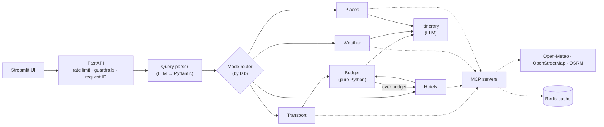

# 🧭 TripMate

**Your AI travel companion for India.** Type a trip in plain English or Hinglish. Get transport options, a hotel, the weather, places to visit, a full budget and a day-by-day plan, in one place.


---

## ✨ Try a query like this

```text
pune se goa 5 din 2 log 60k budget, beaches and seafood
```

TripMate understands it as **Pune → Goa · 5 days · 2 travellers · ₹60,000 · beaches, seafood**, then:

- 🚆 compares **train, bus, cab, self-drive and flight** with estimated fares and recommends the best one
- 🏨 picks a **hotel** that matches your travel style
- 🌦️ checks the **weather for your exact dates**
- 🏖️ finds **famous sights and local places**
- 💰 builds a **budget**, and if you're over it, retries with a cheaper stay and gives saving tips
- 🗓️ writes a **day-by-day plan** with outdoor places on dry days and indoor ones when it rains

Change the transport later and only the budget and itinerary are recalculated, in about a second.

---

## 📊 Results

| What | Result |
|---|---|
| Query understanding (20-case eval, incl. Hinglish and typos) | **99%** of fields correct |
| Transport recommendations (rule-based eval) | **6 / 6** sensible |
| Itinerary quality (LLM-as-judge) | **4.2 / 5**, up from 3.7 after eval-driven prompt fixes |
| Parallel agents | **16.6 s** of agent work finished in **5.1 s** |
| Redis caching | Slow lookups from **43 s → ~3 s**, **72%** cache hit ratio |
| Unit tests | **25 passing** in CI |

---

## 🏗️ How it works



1. **Parser** turns any query into a strict schema, fixes city spelling, and asks a question if something is missing.
2. **Router** picks agents by tab. Full trip runs transport, hotels, weather and places **in parallel**.
3. **Agents** call tools through **MCP servers**. Results are cached in **Redis**.
4. **Budget** is plain Python and loops back for a cheaper hotel when needed (max 2 retries).
5. **Itinerary** uses the real places list and the weather for each day.
6. **Guardrails** check input and output, and the **checkpointer** saves state so plans can be changed later.

---

## 🧠 Key design decisions

| Decision | Why |
|---|---|
| **The LLM never calculates prices** | Python computes every fare and total, so there are no price hallucinations |
| **Routing by tab, not by LLM** | An LLM router picked the wrong agents in testing; tabs make routing predictable |
| **Strict JSON schema output** | Removed broken-JSON errors; retries and a fallback model cover outages |
| **Tools behind MCP servers** | A free data source can be swapped for a paid one without touching agents |
| **Layered fallbacks** | OpenStreetMap → curated famous places → labelled AI suggestions, so no empty screens |
| **Partial replan** | Changing transport reruns 2 of 7 agents from saved state |

More in [docs/design_decisions.md](docs/design_decisions.md).

---

## 🧰 Tech stack

| Layer | Tools |
|---|---|
| **Agents** | LangGraph · LangChain |
| **LLM** | Groq `openai/gpt-oss-20b` (strict JSON schema) · Ollama `llama3.1` fallback |
| **Tools** | MCP (FastMCP) · `langchain-mcp-adapters` |
| **Data** | Open-Meteo · OpenStreetMap (Nominatim, Overpass) · OSRM |
| **State and cache** | Redis Cloud (checkpointer, cache, rate limiting) · SQLite fallback |
| **API and UI** | FastAPI · Streamlit with a custom HTML/CSS design layer |
| **Observability** | LangSmith · Prometheus · Grafana · JSON logs · built-in Monitoring page |
| **Quality** | pytest · LLM evals · LLM-as-judge · GitHub Actions · Docker |

---

## 📈 Observability

| Tool | Answers |
|---|---|
| **Monitoring page** (in the app) | How fast are plans? Which agent is slowest? Is the cache working? |
| **LangSmith** | Why did this plan come out this way? Every agent, prompt, token and cost |
| **Prometheus / Grafana** | Trends and alerts: p95 latency, error rate, plans per tab |
| **JSON logs** | What happened to one request? Search by `request_id` |


---

## 📁 Project structure

```text
tripmate/
├── backend/
│   ├── agents/          one file per agent (parser, transport, hotels, weather, places, budget, itinerary)
│   ├── graph/           LangGraph state, router, builder, checkpointer, replan
│   ├── guardrails/      input and output checks
│   ├── observability/   logs, metrics, tracing
│   └── api/             FastAPI routes
├── mcp_servers/         MCP tool servers, data providers, fare rules, Redis cache
├── frontend/            Streamlit app, components, styles, Monitoring page
├── tests/               unit tests and LLM evals
├── monitoring/          Prometheus and Grafana config
└── docs/                architecture, design decisions, interview notes
```

---

## ⚠️ Good to know

- Fares and hotel prices are **estimates** from distance and city type, not live bookings.
- Weather forecasts cover **16 days ahead**.
- Free public map servers can be slow on a first lookup; caching and fallbacks keep the app responsive.
- For commercial use, swap in paid data providers behind the existing MCP servers (Open-Meteo's free tier is non-commercial).

---

## 🛣️ Roadmap

- [ ] Live train and flight fares from a partner API
- [ ] AWS deployment with Bedrock as the LLM provider
- [ ] Streaming results: transport and weather first, itinerary after
- [ ] User accounts and saved trips
- [ ] Multi-city trips

---

Built by **Pushpak** · [LinkedIn](https://www.linkedin.com/in/your-profile) · [GitHub](https://github.com/your-username)

Weather data by [Open-Meteo.com](https://open-meteo.com) · Maps © [OpenStreetMap](https://www.openstreetmap.org/copyright) contributors
# TripMate-AI-Travel-Planner
